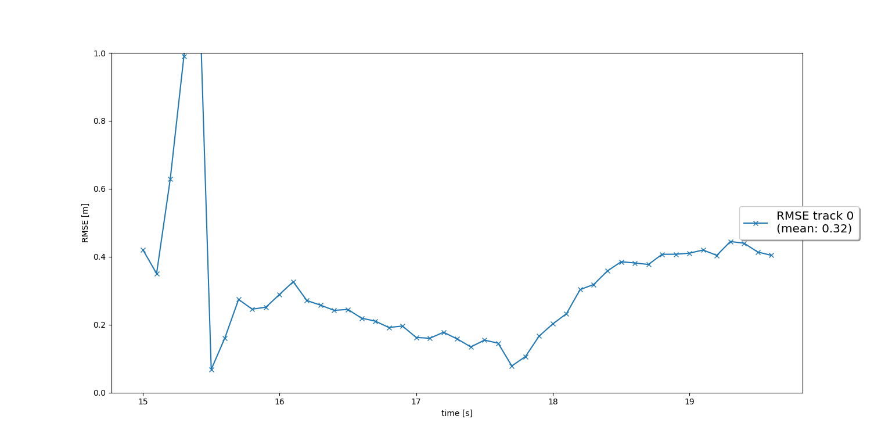
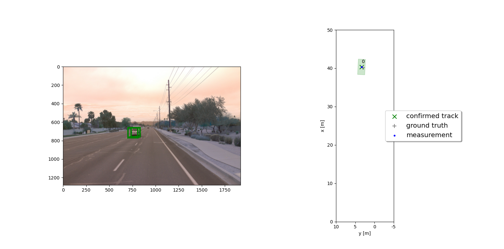
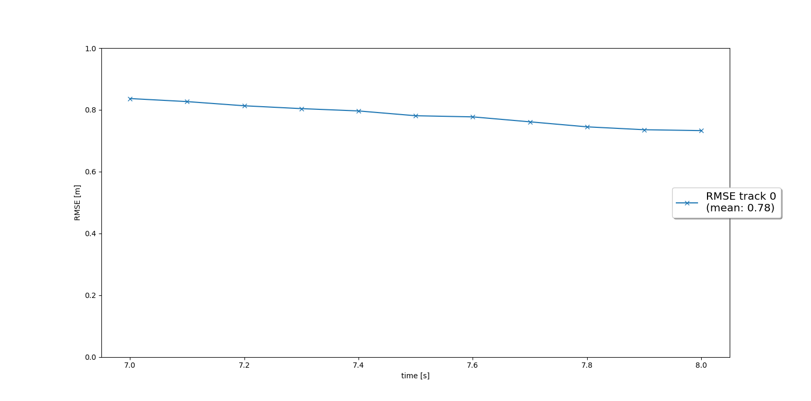
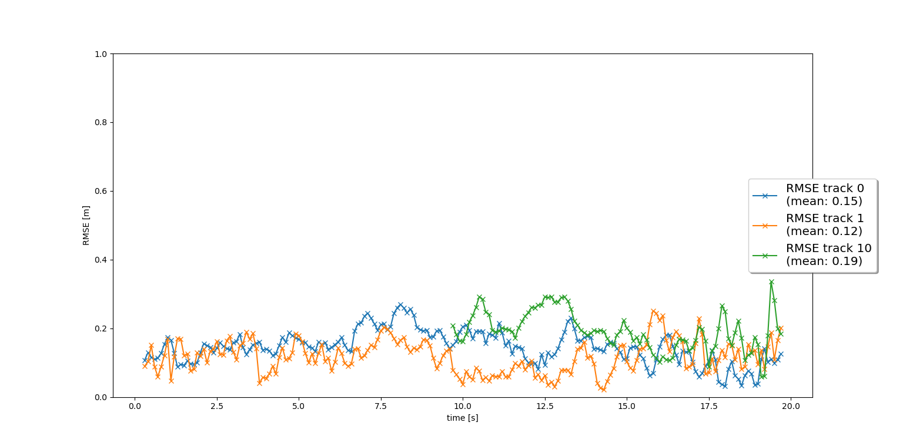
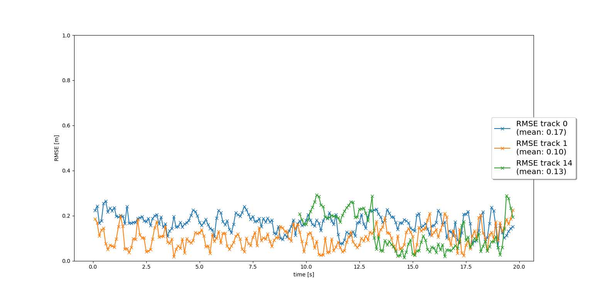
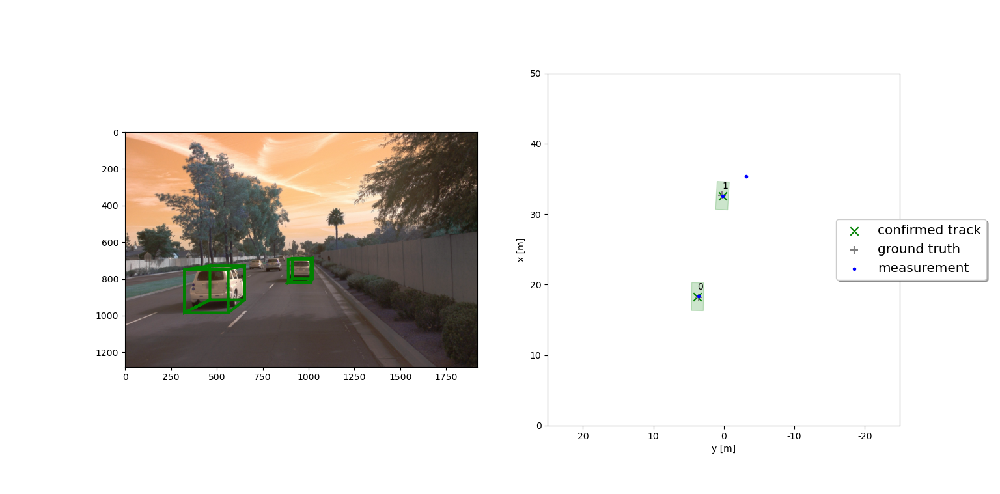

# SDCND : Sensor Fusion and Tracking

## Projects Steps detailed explanations below

### Step One. Implement Extend Kalman Filter

The implementation of the file 'student\filter.py' successfully outcomed the RMSE values shown in the image below:



The image of tracking the vehicle is shown below:



The implementation was based on the template from the exercises homework lesson-3-EKF in the file filter.py and on the project hint that 
hx = H*x.


### Step Two. Implement the Tracking Module

The implementation of the functions in the  student\trackingmanagement.py file followed the instructions from the lectures and the template
from Lesson-4-MTT file initialization.py.
The functions ``__init__`` in the class 'Track' and the function ``manage_tracks`` and ``handle_updated_track`` successfully were created and 
it generated the following outcome for the RMSE graph:



### Step Three. Implement the Association Module

The implementation of the file student\association.py functions followed the lectures and the excercise homework as a template:

The function ``associate`` used the euivalent functions in lesson-4-MTT as a template
The function ``MHD``, ``gating`` and ``get_closest_track_and_meas`` used the equivalent functions in exercise lesson-4-MTT as a template.

The results is shown below as an image of the RMSE values and a video file below:




The video is shown as a icon below. Due to size restrictions it cannot be displayed. Please click the icon and download to view it.


As shown in the 'AVI' file there is a significant number of false positive when working with Lidar alone. For example the trace below
shows a new track created as a vehicle but it is actaully a tree:

````
processing frame #10
loading lidar point-cloud from result file
loading birds-eve view from result file
loading detected objects from result file
loading object labels and validation from result file
loading detection performance measures from file
predict track 0
predict track 1
update track 1 with lidar measurement 1
update track 0 with lidar measurement 0
creating track no. 2
track 0 score = 1
track 1 score = 1
track 2 score = 0.16666666666666666
track 0 score = 1
track 1 score = 1
track 2 score = 0.16666666666666666
Saving frame C:\objectDetProject\results\frameImages\tracking010.png

`````

The image below Shows the frame number 10 where a new track created and shown in red.  It is actaully not a vehicle but a tree. 


The file name is /results/Step_num_three_my_tracking_results.zip and /results/Step_num_three_my_tracking_results.avi and the link below:


Lidar by itself as the video shows generated a significant number of false positives


### Step Four. Implement the Measurement Module

The implementation of the file student\measurement.py functions followed the lectures and the excercise homework as a template:

The function 'fov' followed the lesson-4-MTT as a template
The function 'get_hx' followed the lesson-3-EKF file meanurment.py as a template

The results is shown below as an image of the RMSE values and as a video file below:



The video is shown as a icon below. Due to size restrictions it cannot be displayed. Please click the icon and download to view it.

The file name is /results/Step_num_four_no_false_pos_my_tracking_results.zip and /results/Step_num_four_no_false_pos_my_tracking_results.avi 

and the link below:


As shown in the 'AVI' file the Lidar false positives were removed with sensor fusion.

Below is an example of how the sensor fusion deleted all false positives from the Lidar detection as in frame 10.
The camera fusion deleted the false psoitive.

````
processing frame #10
loading lidar point-cloud from result file
loading birds-eve view from result file
loading detected objects from result file
loading object labels and validation from result file
loading detection performance measures from file
predict track 0
predict track 1
update track 1 with lidar measurement 1
update track 0 with lidar measurement 0
creating track no. 2
track 0 score = 1 State confirmed
track 1 score = 1 State confirmed
track 2 score = 0.16666666666666666 State initialized
update track 1 with camera measurement 4
update track 0 with camera measurement 3
---no more associations---
deleting track no. 2
track 0 score = 1 State confirmed
track 1 score = 1 State confirmed

`````

Below is the same frame 10 as shown above where the false positive track is not shown any more.




### Comparison Between RMSE for Step Three and Step Four

With sensor fusion as the RMSE figures above shows the tracked values is closer to the true values when Camera is fused with Lidar compared
to when Lidar is used alone.

## Sensor Fusion with Camera and Lidar versus Lidar alone

In theory the sesnor fusion estimate the position and velocity of tracked objects closer to the true value. Also it contribute to
eliminating false positive and false negtive.

In practice this was also proven in this project. As the image RMSE values from camera and Lidar fused togther from step 4 shown 
above is smaller tham the RMSE value from Lidar only shown above in step 3. 
Also the false positives were eliminated completey as the AVI file from step 4 shows compared to step 3. Also the image and trace of 
tracks in frame 10 shown above in step 3 and step 4 display how the false psoitives where eliminated


## Which challenges will a sensor fusion system face in real-life scenarios? Did you see any of these challenges in the project?

There is three challenges that sensor fusion might face and I went through two of them in this project.

- Track management heuristics
- False psoitives
- False negatives. This was not as issue in this project

When I implemented my track managment heauristics in step two I found the expected results. But when I implemented step 4 with lidar and
camera sensor fused together I had to go back and modify my logic to take advantge of sensor fusion to eliminate false positive tracks. 
After experimentation I changed my logic to the following to make it more robust and functioning acceptably:

``````````````````
                     if (track.P[0, 0] >= params.max_P or track.P[1, 1] >= params.max_P):
                        delList.append(track)
                    elif (track.score < params.delete_threshold and track.state == 'confirmed'):
                        delList.append(track)
                    elif (track.state != 'confirmed') and (track.score <= 1./params.window):
                        delList.append(track)
                    elif (track.state == 'tentative') and (track.score <= 0.33333333333333337):
                        delList.append(track)
                    else:
                        pass
					
```````````````````

Another challenge is that assume the track of the Lidar is a true track and not a false positive but the camera geneated a falso negative. In that case the camera might delete 
a valid track might be deleted. 

Also the order of the update does matter. When I experimented with updating the camera measurment first followed by the Lidar, all the false positives
were not deteleted. 


## Ways to improve your tracking results in the future?

Lets assume that the Lidar generate a true track but the Camera generate a false negative. Hence it might be beneficial to not delete the track immediately 
but instead move it to a delete pending list and track it for one or two more frame to confirm its status before either to delete it or restore it.

Lets assume that the Camera is updated first and the Lidar after it. The lidar as we saw create new tracks because it seen new measurments even they are
false positive. Hence when a new measurment is found it might be beneficial to create a initialize pending list to track it for another frame so the camera in the
next update cycle can fuse it before it is declared as a new measurment while it is a false positive.


Also I think in general it is useful to combine vehicle-to-vehicle communication technlogy with self driving cars. Then we can fuse the vehicle speed
and GPS location with the Lidar and camaera output to create more robust position and velocity update.